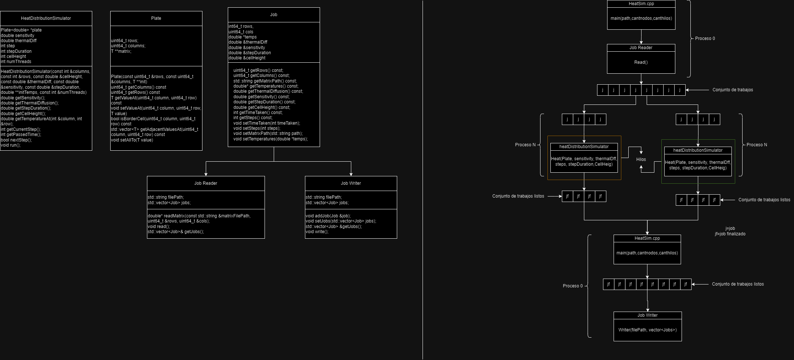

# Diseño del Sistema

El sistema presentado está diseñado para manejar cálculos complejos de distribución de calor a través de un flujo estructurado de datos. A continuación, se detalla el funcionamiento de cada componente del diagrama:

## Heat Sim
Es el punto de entrada principal de la simulación. Toma varios parámetros, como una ruta, la cantidad de nodos y la cantidad de hilos. Este programa lee trabajos desde un archivo, simula la distribución de calor para cada trabajo en paralelo utilizando OpenMP, y escribe los resultados en un archivo de salida. La paralelización permite que múltiples simulaciones se ejecuten simultáneamente.

## Heat Distribution Simulator
Gestiona la simulación de la distribución de calor en una placa bidimensional, utilizando métodos para configurar y acceder a los parámetros de simulación, y métodos para ejecutar la simulación y avanzar en los pasos de cálculo de temperatura. La paralelización se logra mediante OpenMP, lo que permite una simulación más rápida y eficiente. El objetivo final es alcanzar un estado estable donde los cambios de temperatura sean insignificantes según la sensibilidad especificada.

## Job
Almacena y gestiona los datos relacionados con una simulación específica de distribución de calor. Esto incluye las dimensiones de la placa, las temperaturas iniciales, los parámetros de simulación como la difusión térmica y la sensibilidad, y los resultados de la simulación como el número de pasos y el tiempo total tomado.

## Job Writer
Se encarga de escribir los resultados de los trabajos en archivos. Esto incluye tanto la información de los trabajos como las matrices de temperaturas finales después de que la simulación ha sido ejecutada.

## Job Reader
Se encarga de leer y cargar trabajos desde un archivo de texto. Cada línea en el archivo de texto describe un trabajo con sus parámetros y la ruta a un archivo binario que contiene la matriz de temperaturas iniciales.

## Plate
Representa una superficie bidimensional, como una placa, que puede contener valores de temperatura en cada uno de sus puntos. Es utilizada para simular cómo se distribuye el calor en una placa a lo largo del tiempo. La clase gestiona la creación de la placa, el acceso y la modificación de los valores en cada punto, y la identificación de las celdas adyacentes a un punto dado.

# ¿Cómo funciona?
El proceso comienza con la lectura de trabajos a través del `Job Reader`, que se encargan de obtener las instrucciones necesarias. Estas instrucciones pasan al módulo principal, que configura el entorno de la simulación con los parámetros de ruta, cantidad de nodos y cantidad de hilos.

Una vez configurado, el `Heat Distribution Simulator` toma el control, gestionando la distribución del calor mediante el componente `Heat` que ajusta la sensibilidad térmica y otros parámetros críticos.

A medida que los trabajos avanzan, se encolan en el vector de trabajos y, una vez listos, se mueven al conjunto de trabajos listos. Las conexiones entre los componentes aseguran que los datos fluyan correctamente y que cada módulo reciba la información necesaria para llevar a cabo sus cálculos.

Finalmente, los resultados de la simulación se recogen y se envían de vuelta al punto de origen, completando el ciclo de procesamiento y garantizando que las simulaciones se ejecutan de manera eficiente y precisa.
