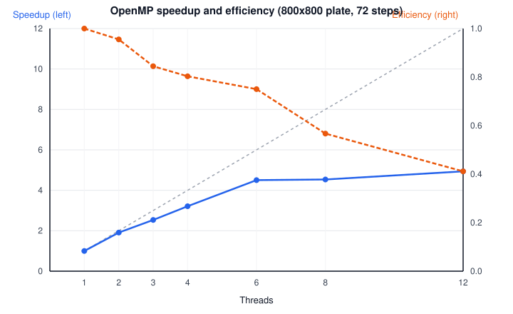

# Análisis de desempeño (Milestone 2.1: OpenMP)

## Advertencia sobre el entorno

Estas mediciones se corrieron en una máquina local (AMD Ryzen 5 5500,
6 núcleos físicos / 12 hilos SMT), **no en el clúster Arenal** que pide
el enunciado del curso. Los números de tiempo absoluto no son
comparables con los del clúster; la metodología y las conclusiones
sobre el comportamiento del paralelismo sí deberían generalizar, pero
para la entrega oficial estas mediciones deben repetirse en Arenal.

## Metodología

- Build: `make release` (`-O3 -DNDEBUG`, sin sanitizers).
- Dataset: placa sintética de 800×800 celdas (640 000 celdas), borde
  constante en 100, interior en 0, `Δt=1`, `α=0.2`, `h=1`, `ε=0.5`.
  Converge en 72 pasos, tiempo serial ~19 s — suficiente para que la
  medición no esté dominada por ruido de arranque de proceso.
- 1 proceso MPI, variando `numThreads` en {1, 2, 3, 4, 6, 8, 12}.
- 3 repeticiones por cantidad de hilos (ver `bench/results.csv`); se
  reporta el promedio.
- Script: `bench/run_bench.sh`, datos crudos en `bench/results.csv`,
  tabla resumen en `bench/summary.json`.

## Resultados

| Hilos | Tiempo (s) | Speedup | Eficiencia |
|------:|-----------:|--------:|-----------:|
|     1 |     19.225 |   1.000 |      1.000 |
|     2 |     10.061 |   1.911 |      0.955 |
|     3 |      7.586 |   2.534 |      0.845 |
|     4 |      5.985 |   3.212 |      0.803 |
|     6 |      4.270 |   4.502 |      0.750 |
|     8 |      4.238 |   4.537 |      0.567 |
|    12 |      3.893 |   4.938 |      0.411 |

## Perfilado con Callgrind

Se perfiló un caso pequeño (100×100, 72 pasos, 1 hilo) con
`valgrind --tool=callgrind` (salida completa en
`Designs/callgrind_top_functions.txt`). El hallazgo principal:
**`HeatDistributionSimulator::nextStep()` llama a
`Plate::getAdjacentValuesAt()` una vez por celda en cada paso, y esa
función asigna un `std::vector<double>` nuevo en el heap solo para
devolver hasta 4 valores.** Sumando todas las funciones relacionadas
con la maquinaria de `std::vector` (`_M_realloc_append`, `malloc`,
`free`, `emplace_back`, alojador, relocación, etc.), representan
**~69% de las instrucciones ejecutadas** — el cómputo físico real
(`getValueAt`, `indexOf`, la actualización con `pow`) es una fracción
pequeña del total.

## Discusión (≤500 palabras)

El speedup crece de forma casi lineal hasta 4 hilos (3.21× con 4
hilos, eficiencia 80%), lo cual es razonable para un `parallel for`
con `reduction` sobre un bucle sin dependencias entre celdas dentro
del mismo paso. A partir de 6 hilos el speedup se aplana (4.50× a 6
hilos, 4.94× a 12) mientras la eficiencia cae con fuerza (75% → 41%).
Esa caída coincide exactamente con el límite de núcleos físicos de la
máquina (6): de 6 a 12 hilos se está usando SMT (hyperthreading), que
no duplica unidades de ejecución reales, solo oculta parte de la
latencia de memoria — y aquí la latencia de memoria es precisamente el
cuello de botella, no el cómputo aritmético.

El perfilado con Callgrind explica por qué el techo aparece tan
temprano: `getAdjacentValuesAt()` asigna y libera un `std::vector` por
celda por paso (640 000 asignaciones por paso en el dataset de 800×800,
46 millones en total). Cada asignación pasa por el allocator global de
glibc, que internamente serializa acceso a estructuras compartidas
(arenas). Con más hilos, la sección paralela deja de estar limitada
por el cómputo (que sí escala) y pasa a estar limitada por la
contención del allocator y por ancho de banda de memoria — de ahí que
agregar hilos más allá del conteo de núcleos físicos rinda cada vez
menos, y que incluso entre 6 y 8 hilos la ganancia ya sea marginal
(4.502× → 4.537×, prácticamente plana).

La implicación práctica es que el techo de escalabilidad actual no es
del diseño de paralelización en sí (mapear una celda por iteración a
un hilo es razonable y es lo que pide el enunciado), sino de una
decisión de implementación ortogonal: `getAdjacentValuesAt()` podría
escribir directamente en variables locales o un arreglo de tamaño fijo
en el stack en vez de un `std::vector` en el heap, eliminando la
asignación dinámica del camino caliente por completo. Esa es la
optimización de mayor impacto disponible antes de intentar exprimir
más paralelismo: hoy se está pagando el costo de sincronización
implícita del allocator en un bucle que, de otra forma, sería
perfectamente paralelo (celdas independientes, sin escritura
compartida entre iteraciones salvo la reducción de `localResult`).

En resumen: la paralelización con OpenMP funciona y da una mejora real
(hasta ~4.9× con 12 hilos SMT en 6 núcleos), pero el dataset de prueba
está limitado por asignación de memoria más que por cómputo, así que
la eficiencia cae rápido pasado el conteo de núcleos físicos. El
próximo paso de optimización debería atacar esa asignación por celda
antes de invertir en estrategias de paralelización más sofisticadas.
